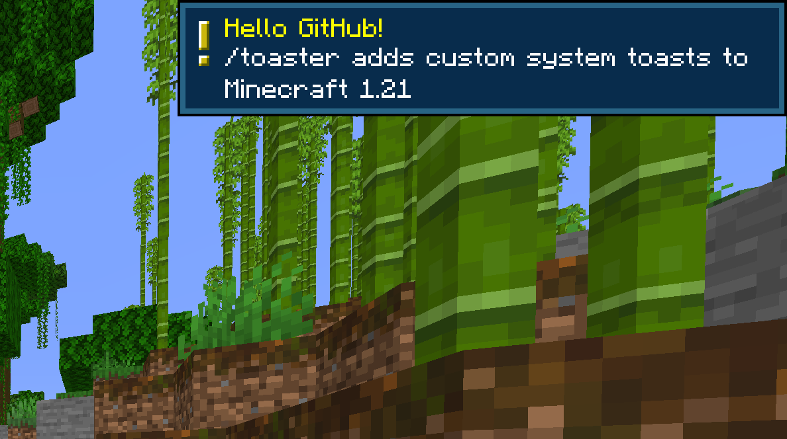

# toaster
1.21 fabric mod which adds the client-side /toaster command which displays a system toast to the user with a custom title and description. Use the "|" delimiter to separate the two messages.

Depends upon the fabric API.

# Example


# Syntax
```/toaster <title>|<description>```
